# Daily Reflection Tree — Visual Diagram

```mermaid
flowchart TD
    START([🌙 START\nWarm opening]) --> A1_OPEN

    %% AXIS 1: LOCUS
    subgraph AX1["AXIS 1 — Locus: Victim ↔ Victor"]
        A1_OPEN[/"❓ A1_OPEN\nWeather metaphor for today"/]
        A1_D1{{"🔀 D1\nStormy/Overcast\nvs\nPartly/Clear"}}
        A1_Q_HARD[/"❓ A1_Q_HARD\nFirst instinct when\nday pushed back"/]
        A1_Q_EASY[/"❓ A1_Q_EASY\nWhat drove what\nworked well"/]
        A1_D2{{"🔀 D2\nControl-seeking\nvs\nBlocked/Froze"}}
        A1_D2B{{"🔀 D2B\nDeliberate\nvs\nLucky/Team"}}
        A1_Q_AGENCY[/"❓ A1_Q_AGENCY\nMoment where you\nhad a choice"/]
        A1_Q_GROWTH[/"❓ A1_Q_GROWTH\nIs luck/team the\nfull story?"/]
        A1_Q_EXTERNAL[/"❓ A1_Q_EXTERNAL\nWas there any\nchoice even then?"/]
        A1_R_INTERNAL["💡 R_INTERNAL\n'You stayed in the\ndriver's seat'"]
        A1_R_NOTICING["💡 R_NOTICING\n'You can see\nthe choice'"]
        A1_R_EXTERNAL["💡 R_EXTERNAL\n'Even waiting\nis a decision'"]
    end

    BRIDGE_1_2(["🌉 BRIDGE 1→2\n'Now let's look\nat what you gave'"])

    %% AXIS 2: ORIENTATION
    subgraph AX2["AXIS 2 — Orientation: Entitlement ↔ Contribution"]
        A2_OPEN[/"❓ A2_OPEN\nHow did you show up\nin the hardest part?"/]
        A2_D1{{"🔀 D1\nGiving\nvs\nTaking/Depleted"}}
        A2_Q_CONTRIBUTION[/"❓ A2_Q_CONTRIBUTION\nDid you give beyond\nwhat was required?"/]
        A2_Q_ENTITLEMENT[/"❓ A2_Q_ENTITLEMENT\nWhat recognition did\nyou feel you deserved?"/]
        A2_D2{{"🔀 D2\nYes/Sort of\nvs\nNot really"}}
        A2_R_CONTRIBUTION["💡 R_CONTRIBUTION\n'Giving without\nbeing asked compounds'"]
        A2_R_NEUTRAL["💡 R_NEUTRAL\n'Honest beats\nperformative'"]
        A2_R_ENTITLEMENT["💡 R_ENTITLEMENT\n'Feeling underrecognised\nis real data'"]
    end

    BRIDGE_2_3(["🌉 BRIDGE 2→3\n'Now let's look at\nwho you thought about'"])

    %% AXIS 3: RADIUS
    subgraph AX3["AXIS 3 — Radius: Self-Centrism ↔ Altrocentrism"]
        A3_OPEN[/"❓ A3_OPEN\nWhose experience was\nin your mind?"/]
        A3_D1{{"🔀 D1\nMine / Colleague\n/ Team / Downstream"}}
        A3_Q_SELF[/"❓ A3_Q_SELF\nWas anyone else\naffected today?"/]
        A3_Q_TEAM[/"❓ A3_Q_TEAM\nHow did thinking about\nteam change your actions?"/]
        A3_Q_BEYOND[/"❓ A3_Q_BEYOND\nHow did the end user\nchange your energy?"/]
        A3_D2{{"🔀 D2\nUnaware\nvs\nAware"}}
        A3_R_SELF["💡 R_SELF\n'Survival is valid;\nnotice tomorrow'"]
        A3_R_AWARE["💡 R_AWARE\n'Naming it is\nperspective-taking'"]
        A3_R_COLLECTIVE["💡 R_COLLECTIVE\n'You held the team\nin your awareness'"]
        A3_R_TRANSCENDENT["💡 R_TRANSCENDENT\n'Maslow: self-\ntranscendence'"]
    end

    SUMMARY["📊 SUMMARY\nPersonalised synthesis\nusing state + interpolation"]
    END(["✅ END\nRest well"])

    %% CONNECTIONS — Axis 1
    A1_OPEN --> A1_D1
    A1_D1 -->|"Stormy/Overcast"| A1_Q_HARD
    A1_D1 -->|"Partly/Clear"| A1_Q_EASY
    A1_Q_HARD --> A1_D2
    A1_Q_EASY --> A1_D2B
    A1_D2 -->|"Control/Push"| A1_Q_AGENCY
    A1_D2 -->|"Blocked/Frozen"| A1_Q_EXTERNAL
    A1_D2B -->|"Deliberate/Call"| A1_Q_AGENCY
    A1_D2B -->|"Lucky/Team"| A1_Q_GROWTH
    A1_Q_AGENCY --> A1_R_INTERNAL
    A1_Q_GROWTH --> A1_R_INTERNAL
    A1_Q_EXTERNAL -->|"Yes used it"| A1_R_NOTICING
    A1_Q_EXTERNAL -->|"Yes didn't\n/Not sure"| A1_R_NOTICING
    A1_Q_EXTERNAL -->|"Not really\n/Constraint real"| A1_R_EXTERNAL

    %% Bridge 1→2
    A1_R_INTERNAL --> BRIDGE_1_2
    A1_R_NOTICING --> BRIDGE_1_2
    A1_R_EXTERNAL --> BRIDGE_1_2

    %% CONNECTIONS — Axis 2
    BRIDGE_1_2 --> A2_OPEN
    A2_OPEN --> A2_D1
    A2_D1 -->|"Gave more/Required"| A2_Q_CONTRIBUTION
    A2_D1 -->|"Deserved more/Pulled back"| A2_Q_ENTITLEMENT
    A2_Q_CONTRIBUTION --> A2_D2
    A2_D2 -->|"Yes/Sort of"| A2_R_CONTRIBUTION
    A2_D2 -->|"Not really"| A2_R_NEUTRAL
    A2_Q_ENTITLEMENT --> A2_R_ENTITLEMENT

    %% Bridge 2→3
    A2_R_CONTRIBUTION --> BRIDGE_2_3
    A2_R_NEUTRAL --> BRIDGE_2_3
    A2_R_ENTITLEMENT --> BRIDGE_2_3

    %% CONNECTIONS — Axis 3
    BRIDGE_2_3 --> A3_OPEN
    A3_OPEN --> A3_D1
    A3_D1 -->|"Mine"| A3_Q_SELF
    A3_D1 -->|"Colleague/Team"| A3_Q_TEAM
    A3_D1 -->|"Downstream"| A3_Q_BEYOND
    A3_Q_SELF --> A3_D2
    A3_D2 -->|"No bandwidth\n/Hadn't considered"| A3_R_SELF
    A3_D2 -->|"Yes checked in\n/Mine to carry"| A3_R_AWARE
    A3_Q_TEAM --> A3_R_COLLECTIVE
    A3_Q_BEYOND --> A3_R_TRANSCENDENT

    %% To Summary
    A3_R_SELF --> SUMMARY
    A3_R_AWARE --> SUMMARY
    A3_R_COLLECTIVE --> SUMMARY
    A3_R_TRANSCENDENT --> SUMMARY
    SUMMARY --> END

    %% Styling
    classDef question fill:#4A90D9,stroke:#2C5F8A,color:#fff,rx:8
    classDef decision fill:#F5A623,stroke:#C07D0A,color:#fff
    classDef reflection fill:#7ED321,stroke:#4A7D0F,color:#fff,rx:8
    classDef bridge fill:#9B59B6,stroke:#6C3483,color:#fff,rx:8
    classDef endpoint fill:#2C3E50,stroke:#1A252F,color:#fff,rx:20
    classDef summary fill:#E74C3C,stroke:#A93226,color:#fff,rx:8

    class A1_OPEN,A1_Q_HARD,A1_Q_EASY,A1_Q_AGENCY,A1_Q_GROWTH,A1_Q_EXTERNAL question
    class A2_OPEN,A2_Q_CONTRIBUTION,A2_Q_ENTITLEMENT question
    class A3_OPEN,A3_Q_SELF,A3_Q_TEAM,A3_Q_BEYOND question
    class A1_D1,A1_D2,A1_D2B,A2_D1,A2_D2,A3_D1,A3_D2,A3_D3,A3_D4,A1_D3,A1_D4,A1_D5,A2_D3 decision
    class A1_R_INTERNAL,A1_R_NOTICING,A1_R_EXTERNAL reflection
    class A2_R_CONTRIBUTION,A2_R_NEUTRAL,A2_R_ENTITLEMENT reflection
    class A3_R_SELF,A3_R_AWARE,A3_R_COLLECTIVE,A3_R_TRANSCENDENT reflection
    class BRIDGE_1_2,BRIDGE_2_3 bridge
    class START,END endpoint
    class SUMMARY summary
```



## Legend

| Symbol | Node Type | Behaviour |
|--------|-----------|-----------|
| ❓ | Question | Employee picks one of 3–5 fixed options |
| 🔀 | Decision | Internal routing — invisible to employee, auto-advances |
| 💡 | Reflection | Employee reads reframe, clicks Continue |
| 🌉 | Bridge | Axis transition statement, auto-advances |
| 📊 | Summary | Synthesised from accumulated state + interpolation |
| ✅ | End | Session close |

## Axis Signal Tallying

```
Every question and reflection node carries a signal tag:
  axis1:internal  or  axis1:external
  axis2:contribution  or  axis2:entitlement
  axis3:self  or  axis3:collective  or  axis3:transcendent

At SUMMARY, axis1.dominant = argmax(axis1.internal, axis1.external)
The summary text is assembled from the summary_map in reflection-tree.json
```
